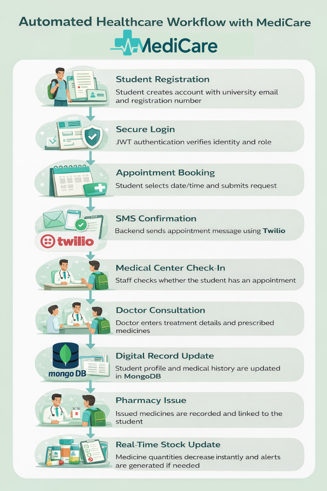

  
  
  <h1 style="color: #2c3e50;">🏥 MediCare – Medical Center Management System</h1>

  <i>A modernized, digital platform designed exclusively for university students and staff to manage medical workflows efficiently.</i>

## 📌 System Overview

**MediCare** is a full-stack web application developed to digitalize and modernize the operations of the **Sabaragamuwa University Medical Center**. The system replaces the traditional manual workflow with a secure, efficient, and centralized digital platform gracefully orchestrating student registration, appointments, doctor consultations, and pharmacy stock management.

  

## 📖 Operational Workflow: Student Registration to Pharmacy

### 1️⃣ Student Profile Creation and Registration

Students first register using their university email address, registration number, and password. After registration, the system creates a student profile that can store personal details and later connect medical history, appointments, requests, and prescribed medicines. The report describes this as the student management module with secure registration and authenticated access.

  

### 2️⃣ Technology & Data Storage Dashboard

**Technology used for registration and login:**
The frontend is built with React for a responsive user interface, the backend uses Node.js with Express.js to handle APIs and business logic, and MongoDB is used as the database. For security, MediCare uses JWT authentication and role-based access control, so students, doctors, pharmacists, and admins can only access the features allowed for their role.

**Student data is stored:**
All student-related data is stored in MongoDB, including student records, appointments, medical histories, prescriptions, and medicine stock data. This makes it possible to keep everything in one centralized digital system instead of paper files.

  

### 3️⃣ Online Appointment Request & Confirmation

**Student online appointment request flow:**
After logging in, a student can open the appointment module, select an available date and time slot, and submit an appointment request. The system checks doctor availability and validates operating dates so bookings are only made on allowed working days. Once saved, the appointment record becomes visible in both the student and staff/doctor dashboards.

**How appointment confirmation is sent to the student:**
When an appointment is successfully confirmed, the system can send a notification to the student. In your project context, this can be explained as using Twilio SMS integration: the backend triggers the Twilio API after appointment confirmation, and an SMS is sent to the student’s mobile number with the appointment date and time. Your report also includes appointment confirmation message screenshots, and future improvement notes mention enhancing automatic SMS alerts.

  

### 4️⃣ Medical Center Arrival & Doctor Consultation

**What happens when the student arrives at the medical center:**
When the student comes to the medical center, staff can check the system using the student’s registration number or other identifying details. The admin/staff interface shown in the report includes a feature to check whether a student already has an appointment.

**If the student already has an appointment:**
If the student has a valid appointment, staff can confirm the visit in the system and direct the student to the doctor. This keeps the appointment workflow organized and ensures the visit is recorded digitally.

**If the student has no appointment:**
If the student does not have an appointment, staff can still check the case. For an emergency or urgent case, the student can be entered into the system manually as a direct visit or special case, so treatment is not blocked by the appointment process. This is a practical workflow explanation for real medical center use and fits the staff-side student entry/checking process shown in the report screenshots.

**Doctor consultation and medicine entry:**
After consultation, the doctor can open the student’s medical profile and enter diagnosis-related details, treatment information, and prescribed medicines. The doctor interface in the report shows medicine record entry for students and access to personal and medical information.

**How medicine details are stored in the student profile:**
When the doctor adds medicines, the data is saved as part of the student’s digital medical record. This means the student profile becomes a growing health record that can include previous visits, treatment notes, prescriptions, and medicine history. Students can later view parts of this through their own dashboard.

  

### 5️⃣ Medical Approval Workflow

Once treatments are diagnosed, the system follows a structured workflow to securely approve, organize, and dispatch medical records and requests.

  

### 6️⃣ Pharmacy & Inventory Management

**Real-time medicine stock update:**
Once medicine is issued, the pharmacy or medicine module updates stock levels in real time. This reduces the available quantity automatically and helps the system maintain accurate inventory levels. The report specifically describes real-time medicine stock tracking and shows a pharmacist dashboard with low-stock and expiry indicators.

**Low-stock and expiry alerts:**
Because stock data is updated instantly, the system can detect low-stock medicines and near-expiry medicines automatically. This helps pharmacists and staff take action early and prevents shortages or unsafe medicine use.

  

## 🧰 Technology Stack

  <table border="1" cellpadding="10" cellspacing="0" style="width: 80%; text-align: left;">
    <tr style="background-color: #f7f9fc;">
      <th>Layer</th>
      <th>Technology</th>
    </tr>
    <tr>
      <td><b>Frontend</b></td>
      <td>React.js (Responsive UI)</td>
    </tr>
    <tr>
      <td><b>Backend</b></td>
      <td>Node.js, Express.js (RESTful APIs)</td>
    </tr>
    <tr>
      <td><b>Database</b></td>
      <td>MongoDB (Centralized Data Storage)</td>
    </tr>
    <tr>
      <td><b>Authentication</b></td>
      <td>JWT (Role-Based Access Control)</td>
    </tr>
    <tr>
      <td><b>Notifications</b></td>
      <td>Twilio API (SMS Alerts)</td>
    </tr>
    <tr>
      <td><b>Deployment</b></td>
      <td>Vercel (Frontend) & DigitalOcean (Backend)</td>
    </tr>
  </table>

## 👨‍💻 Author

  <b>Chehan Lasindu</b> 
  Department of Physical Sciences and Technology 
  Faculty of Applied Sciences 
  Sabaragamuwa University of Sri Lanka

  ⭐ <i>If you found this documentation helpful, please consider giving the repository a star!</i>

